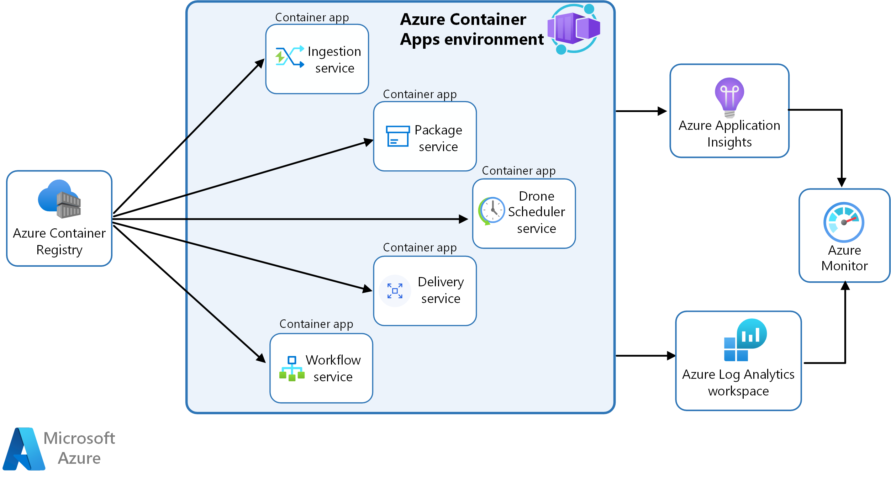
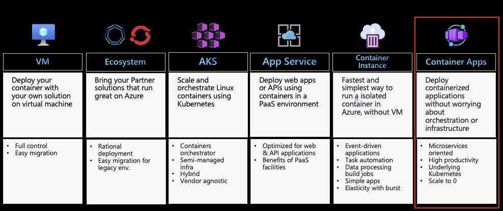
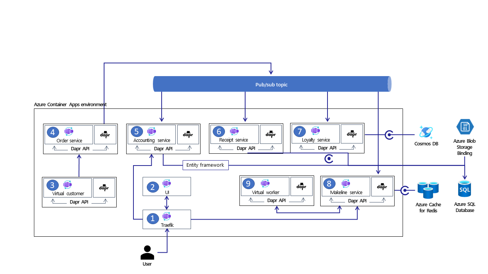

# Azure Container Apps and DAPR Resources

This page gathers some resources to start with [Azure Container Apps](https://learn.microsoft.com/en-us/azure/container-apps/overview) (ACA) and [DAPR](https://dapr.io/).

Start here to get an overall preview => [Azure Container Apps + DAPR](https://livesend.microsoft.com/i/Hn75tMaQhfpTqXcJSjOLExTLRfIZc7YHMeBjaLEo4bbjJEsQPs1bcGKnVSKD8m2RSO___nA1hvQ1PLUSSIGNPsR2___qibp27Dh3D08D8KITx7kfmsBuwEK24nmqVz5QUpHPLUSSIGNEl41u6W)

# Azure Container Apps Overview

**Azure Container Apps**  enables you to run microservices and containerized applications on a serverless platform. Common uses of Azure Container Apps include:
 - Deploying API endpoints
 - Hosting background processing applications
 - Handling event-driven processing
 - Running microservices
 - Host web Application

[Source: Deploy microservices with Azure Container Apps](https://learn.microsoft.com/en-us/azure/architecture/example-scenario/serverless/microservices-with-container-apps)

# Container hosting services in Azure

 - [Comparing Container Apps with other Azure container options](https://learn.microsoft.com/en-us/azure/container-apps/compare-options)

# Architecture Sample

[Source: Deploy microservices with Azure Container Apps](https://learn.microsoft.com/en-us/azure/architecture/example-scenario/serverless/microservices-with-container-apps)

# Links

This section lists a lot of resources to start with [Azure Container Apps](https://learn.microsoft.com/en-us/azure/container-apps/overview) (ACA) and [DAPR](https://dapr.io/).

## Tutorials / Workshops

 - [Azure Container Apps Workshop](https://github.com/lgmorand/workshop-aca)
 - [Deploy to Azure Container Apps Workshop (quarkus.io)](https://quarkus.io/quarkus-workshops/super-heroes/index-azure.html)
 - [Hello, Azure Container Apps - Building Cloud Native Apps](https://azure.github.io/Cloud-Native/blog/09-aca-fundamentals/)

## Videos

 - [azure container apps - Bing video](https://www.bing.com/videos/search?q=azure+container+apps+&FORM=HDRSC4)
 - [Azure Container Apps Tutorial Step by Step on YouTube](https://www.youtube.com/watch?v=MeTf58rE6oI&list=PLhl73Ukl8yfS9bTHeZ8FoklfC6D4Fk3Kj)
 - [Azure Container Apps - YouTube](https://www.youtube.com/playlist?list=PLG9qZAczREKlgkenSQh8nK3dTA4lTeD3N)

## Blogs

 - [Azure Container Apps - Thorsten Hans' blog (thorsten-hans.com)](https://www.thorsten-hans.com/tags/azure-container-apps/)
 - [azure-container-apps - Paul's Blog (paulyu.dev)](https://paulyu.dev/tags/azure-container-apps/)
 - [Log storage and monitoring options in Azure Container Apps - Microsoft Learn](https://learn.microsoft.com/en-us/azure/container-apps/log-options)

## Sample Apps

 - [Azure Container Apps samples - Microsoft Learn](https://learn.microsoft.com/en-us/azure/container-apps/samples)
 - [Azure-Samples/containerapps-albums: Companion repo for Azure Container Apps Tutorials and Samples (github.com)](https://github.com/Azure-Samples/containerapps-albums)

# DAPR

## What is Dapr?

**Dapr** is a portable, event-driven runtime that makes it easy for any developer to build resilient, stateless and stateful applications that run on the cloud and edge and embraces the diversity of languages and developer frameworks. Leveraging the benefits of a sidecar architecture, Dapr helps you tackle the challenges that come with building microservices and keeps your code platform agnostic.

[>> Get Started here!](https://docs.dapr.io/getting-started/)

# DAPR Architecture

[Source: Deploy microservices with Azure Container Apps and Dapr](https://learn.microsoft.com/en-us/azure/architecture/example-scenario/serverless/microservices-with-container-apps-dapr)

# Links

## eBooks

 - [Dapr for .NET Developers - Microsoft Learn](https://learn.microsoft.com/en-us/dotnet/architecture/dapr-for-net-developers/)

## Tutorials / Walkthrough

 - [Building great microservices solutions with Dapr and .NET (linkedin.com)](https://www.linkedin.com/learning/azure-dapr-for-dot-net-developers-part-1/building-great-microservices-solutions-with-dapr-and-dot-net?u=3322)
 - [Bienvenue dans « L'essentiel de Dapr » (linkedin.com)](https://www.linkedin.com/learning/l-essentiel-de-dapr/bienvenue-dans-l-essentiel-de-dapr?u=3322)
 - [14. Build ACA with Dapr - Building Cloud Native Apps (azure.github.io)](https://azure.github.io/Cloud-Native/blog/14-dapr-aca-quickstart/)
 - [WhatTheHack/047-TrafficControlWithDapr at master · microsoft/WhatTheHack (github.com)](https://github.com/microsoft/WhatTheHack/tree/master/047-TrafficControlWithDapr)

## Videos

 - [Zero to Hero with Dapr - YouTube](https://www.youtube.com/watch?v=AAQSShtl9S0)
 - [Microservices with Azure Container Apps and Dapr - YouTube](https://www.youtube.com/watch?v=s96io88CM6A&list=PLG9qZAczREKlgkenSQh8nK3dTA4lTeD3N)
 - [Azure Container Apps Tutorial Step by Step ☁️ - YouTube](https://www.youtube.com/playlist?list=PLhl73Ukl8yfS9bTHeZ8FoklfC6D4Fk3Kj)
 - [Dapr community call 31 - 2/9/2021 - YouTube](https://www.youtube.com/watch?v=ngIDOQApx8g) (Advanced implementation with Istio)

## Blogs
 - [How Distributed Application Runtime (Dapr) has grown since its announcement - Microsoft Open Source Blog](https://cloudblogs.microsoft.com/opensource/2020/04/29/distributed-application-runtime-dapr-growth-community-update/)
 - [Tutorial for building Microservice Applications with Azure Container Apps and Dapr - Part 1 - Bit of Technology](https://bitoftech.net/2022/08/25/tutorial-building-microservice-applications-azure-container-apps-dapr/)
 - [Craig Shoemaker on Twitter Are you ready for to start building microservices and containerized apps?](https://twitter.com/craigshoemaker/status/1529131988468244486?t=DnuPHn7L7Jkgwzysj7DQTg&s=19)

## Sample Apps
 - [Azure-Samples/container-apps-store-api-microservice: Sample microservices solution using Azure Container Apps, Dapr, Cosmos DB, and Azure API Management (github.com)](https://github.com/Azure-Samples/container-apps-store-api-microservice)
 - [Azure/reddog-code: Source code repository for the reddog demo, brought to you by the Cloud Native Global Black Belt Team. (github.com)](https://github.com/Azure/reddog-code)
 - [microsoft/dotnet-podcasts: .NET 6 reference application shown at .NET Conf 2021 featuring ASP.NET Core, Blazor, .NET MAUI, Microservices, and more! (github.com)](https://github.com/microsoft/dotnet-podcasts)
