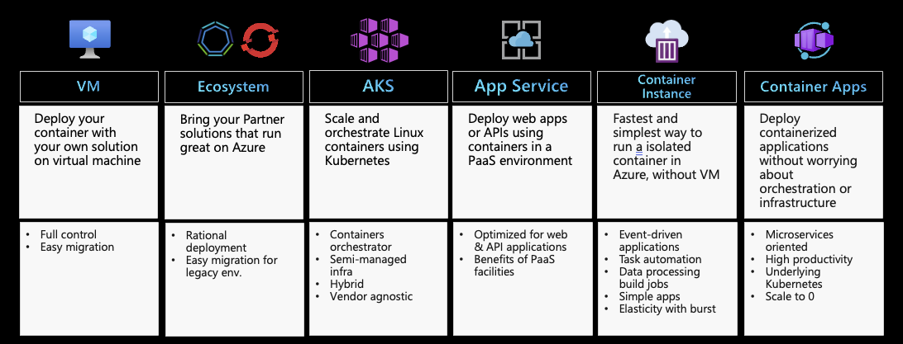

# Azure Kubernetes Services - AKS Resources

Azure Kubernetes Service (AKS) simplifies deploying a managed Kubernetes cluster in Azure by offloading the operational overhead to Azure. As a hosted Kubernetes service, Azure handles critical tasks, like health monitoring and maintenance. When you create an AKS cluster, a control plane is automatically created and configured. This control plane is provided at no cost as a managed Azure resource abstracted from the user. You only pay for and manage the nodes attached to the AKS cluster.

This page gathers a lot of resources to start with [Azure Kubernetes Services - AKS](https://learn.microsoft.com/en-us/azure/aks/)

# Overview
 

 [Source: AKS Intro](https://learn.microsoft.com/en-us/azure/aks/intro-kubernetes)

# Container Hosting Service on Azure
 

 [Source: How to choose a compute service](https://learn.microsoft.com/en-us/azure/architecture/guide/technology-choices/compute-decision-tree#choose-a-candidate-service)

# Architecture Sample
 
[Source: Microservices architecture on Azure Kubernetes Service](https://learn.microsoft.com/en-us/azure/architecture/browse/?terms=aks)

# AKS Landing Zone
Strategic design path and target technical state for an Azure Kubernetes Service (AKS) deployment.

 

 [Source: AKS Landing Zone](https://docs.microsoft.com/en-us/azure/cloud-adoption-framework/scenarios/app-platform/aks/landing-zone-accelerator)

Reference architecture, we'll build a baseline infrastructure that deploys an Azure Kubernetes Service (AKS) cluster
- [AKS Baseline](https://docs.microsoft.com/en-us/azure/architecture/reference-architectures/containers/aks/secure-baseline-aks)

# Links

## Basic Concepts
 - [Kubernetes core concepts for Azure Kubernetes Service](https://learn.microsoft.com/en-us/azure/aks/concepts-clusters-workloads)

## Tutorial / Workshop

 - [AKS on Microsoft Learn](https://docs.microsoft.com/en-us/learn/browse/?expanded=azure&filter-products=kub&products=azure-kubernetes-service)
 - [AKS Workshop](https://docs.microsoft.com/en-us/learn/modules/aks-workshop/)
 - [AKS Learning Path](https://azure.microsoft.com/en-us/resources/kubernetes-learning-path/)

## Blogs

 - [Learn K8s](https://learnk8s.io/blog)
 - [Stanislas Quastana Blog (FR)](https://stanislas.io/?s=aks)

## Videos

 - [Brendan Burns](https://www.youtube.com/playlist?list=PLLasX02E8BPCrIhFrc_ZiINhbRkYMKdPT)
 - [John Savill](https://www.youtube.com/c/NTFAQGuy/search?query=aks)
 - [Houssem Dellai](https://www.youtube.com/playlist?list=PLpbcUe4chE79sB7Jg7B4z3HytqUUEwcNE)

## eBook

 - [Kubernetes Learning Path](https://azure.microsoft.com/en-us/resources/kubernetes-learning-path/)
 - [Get up and running with K8s](https://azure.microsoft.com/en-us/resources/kubernetes-ebook-collection/)
 - [Designing Distributed Systems](https://azure.microsoft.com/en-us/resources/designing-distributed-systems/)

## Usefull tools and 3rd party

 - [AKS Best Practices](https://docs.microsoft.com/en-us/azure/aks/best-practices)
 - [AKS CheckList by LG Morand](https://www.the-aks-checklist.com/)
 - [AKS GitHub Project](https://github.com/Azure/AKS)

## Sample Application

 - [AKS Fabrikam Drone Delivery](https://github.com/mspnp/aks-fabrikam-dronedelivery)

