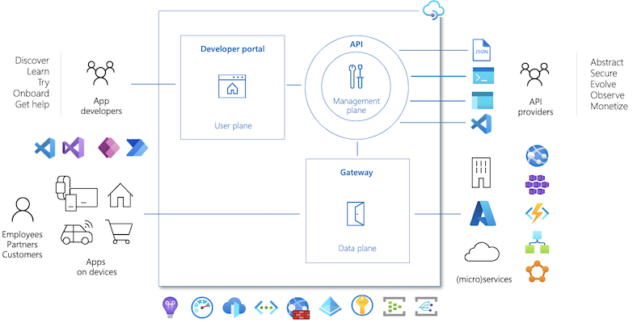

# Azure API Management Resources

This page gathers a lot of resources to start with [Azure API Management - APIM](https://learn.microsoft.com/en-us/azure/api-management/)

The best way to start with Azure API Management is **[APIM Resource Portal](https://aka.ms/apimlove)**
You'll find in this page plenty of information. Moreover, this page is frequently updated by the Microsoft APIM Product Group.

# APIM Overview

Azure API Management is a turnkey solution for publishing APIs to external and internal customers. This service helps to create consistent and modern API gateways for existing back-end services hosted anywhere, secure and protect them from abuse and overuse, and get insights into usage and health. Plus, it automates and scales developer on-boarding to help get your API program up and running.
On-boarding of developers happens via the Developer Portal (which Azure API Management provisions for you along with API gateway). Here they can read API documentation, create an account, get subscription key (to be able to invoke the API), and even try making some calls to the API right from the portal using a specialized console.

Azure API Management helps customers meet these challenges:
 - Abstract backend architecture diversity and complexity from API consumers
 - Securely expose services hosted on and outside of Azure as APIs
 - Protect, accelerate, and observe APIs
 - Enable API discovery and consumption by internal and external users

Common scenarios include:
 - Unlocking legacy assets
 - API-centric app integration
 - Multi-channel user experiences
 - B2B integration

Azure API Management is made up of an API gateway, a management plane, and a developer portal. These components are Azure-hosted and fully managed by default. 

# Links

## Tutorials / Workshops

 - [Import and publish your first API in APIM](https://learn.microsoft.com/en-us/azure/api-management/import-and-publish)
 - [Azure Apim Hands on Lab](https://azure.github.io/apim-lab/)

## Blogs

 - [Azure PaaS Blog](https://techcommunity.microsoft.com/t5/azure-paas-blog/bg-p/AzurePaaSBlog/label-name/azure%20api%20management)

## Videos

 - [APIM Ultimate Learning Course - 3hours](https://www.youtube.com/watch?v=K-tYU8GOUt0)
 - [Protect Your Backend API with Azure AD using APIM](https://www.youtube.com/watch?v=_FigPkMbinU)

## 3rd Party tools

 - [PostMan](https://www.postman.com)
 - [Online OpenAPI Editor](https://editor.swagger.io/)
 - [RequestBin.com](https://requestbin.com/)
 - [Online OpenAPI Editor](https://editor.swagger.io/)
 - [ngrok](https://ngrok.com/product)
 - [OpenAPI Tools list](https://openapi.tools/)

## eBooks

 - [API Design](https://aka.ms/api-design-ebook)
 - [Whitepaper: API Management in a hybrid and multi-cloud world](https://aka.ms/apimarc)
 - [Driving Digital Transformation in Today’s API Economy](https://azure.microsoft.com/en-us/resources/azure-api-management-driving-digital-transformation-in-todays-api-economy/)

## APIOps / API GitOps

 - [Automate API deployments with APIOps](https://learn.microsoft.com/en-us/azure/architecture/example-scenario/devops/automated-api-deployments-apiops)
 - [Concepts of GitOps and DevOps to API deployment](https://azure.github.io/apiops)
