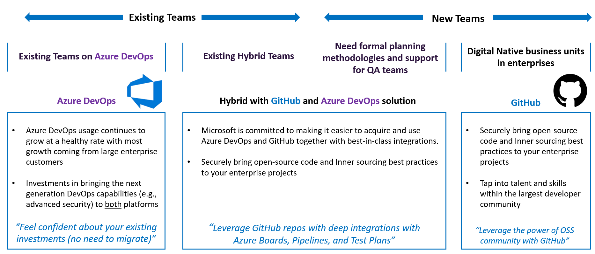

# Azure DevOps and GitHub Resources

This page lists a lot of resources to start with **Azure DevOps** and **GitHub**

# DevOps Overview

DevOps combines development (Dev) and operations (Ops) to unite people, process, and technology in application planning, development, delivery, and operations. DevOps enables coordination and collaboration between formerly siloed roles like development, IT operations, quality engineering, and security.

Teams adopt DevOps culture, practices, and tools to increase confidence in the applications they build, respond better to customer needs, and achieve business goals faster. DevOps helps teams continually provide value to customers by producing better, more reliable products.

[Source: What is DevOps?](https://learn.microsoft.com/en-us/devops/what-is-devops)

## Azure DevOps

Azure DevOps supports a collaborative culture and set of processes that bring together developers, project managers, and contributors to develop software. It allows organizations to create and improve products at a faster pace than they can with traditional software development approaches.

## GitHub
GitHub is a code hosting platform for version control and collaboration. It lets you and others work together on projects from anywhere.
GitHub Actions is a continuous integration and continuous delivery (CI/CD) platform that allows you to automate your build, test, and deployment pipeline. You can create workflows that build and test every pull request to your repository, or deploy merged pull requests to production.

GitHub Actions goes beyond just DevOps and lets you run workflows when other events happen in your repository. For example, you can run a workflow to automatically add the appropriate labels whenever someone creates a new issue in your repository.

## Azure DevOps or GitHub
How to choose between Azure DevOps and GitHub?

## Azure DevOps + GitHub
There is an another alternative by connecting Azure Boards with GitHub repositories, you enable linking between GitHub commits, pull requests, and issues to work items. You can use GitHub for software development while using Azure Boards to plan and track your work. 

## Github Architecture Sample

[Source: DevSecOps with GitHub Security](https://learn.microsoft.com/en-us/azure/architecture/solution-ideas/articles/devsecops-in-github)

## Tutorials / Workshops

### DevOps
 - [What is DevOps?](https://learn.microsoft.com/en-us/devops/what-is-devops)
 - [DevOps Resource Center](https://learn.microsoft.com/en-us/devops/)
 - [DevOps Consideration and Landing Zone](https://learn.microsoft.com/en-us/azure/cloud-adoption-framework/ready/considerations/devops-principles-and-practices)
 - [DevOps Dojo](https://devblogs.microsoft.com/devops/intro-of-devops-dojo/)

### GitHub
 - [GitHub Learning Lab · GitHub Marketplace](https://github.com/marketplace/github-learning-lab)
 - [Microsoft Learn for GitHub](https://learn.microsoft.com/en-us/training/github/)
 - [GitHub Skills](https://skills.github.com/)
 - [GitHub Documentation](https://docs.github.com/en)

### Azure DevOps
 - [Azure DevOps on Microsoft Learn](https://learn.microsoft.com/en-us/training/browse/?expanded=azure&products=azure-devops)
 - [Azure DevOps Labs](https://www.azuredevopslabs.com/)
 
### DevSecOps
 - [Microsoft Defender for DevOps - the benefits and features](https://learn.microsoft.com/en-us/azure/defender-for-cloud/defender-for-devops-introduction)
 
### Hand's on Labs / MicroHacks
 - [What The Hack – Azure DevOps (microsoft.github.io)](https://microsoft.github.io/WhatTheHack/010-AzureDevOps/)
 - [What The Hack – DevOps with GitHub (microsoft.github.io)](https://microsoft.github.io/WhatTheHack/031-DevOpsWithGitHub/)

## Videos

 - [DevOps on Azure](https://www.youtube.com/@AzureDevOps)
 - [Azure DevOps Tutorial For Beginners](https://www.youtube.com/playlist?list=PLaFzfwmPR7_Ifxq-udm66fhReFeGOe2x_)
 - [Houssem Dellai - Azure DevOps CI/CD](https://www.youtube.com/playlist?list=PLpbcUe4chE7_J_la3FlruUfAN1ec7H_bR)
 - [Houssem Dellai - Learn GitHub Actions](https://www.youtube.com/playlist?list=PLpbcUe4chE7-6zbykHL9ASi3zlP5PHROo)

## Blogs

 - [Azure DevOps Blog Updates](https://devblogs.microsoft.com/devops/category/community/)
 - [GitHub Blog](https://github.blog/)

## eBook

 - [Empowering developers to build secure software faster with GitHub Advanced Security](https://resources.github.com/security/secure-software-faster-ebook/)
 - [How static application security testing (SAST) can help you fix bugs at the speed of development?](https://resources.github.com/security/sast/?submitted=true)
 - [Azure DevOps Explained (published by Packt)](https://github.com/PacktPublishing/Learning-Azure-DevOps---B16392)

