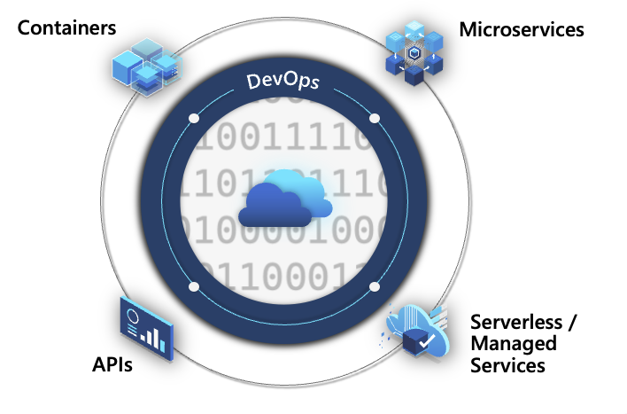
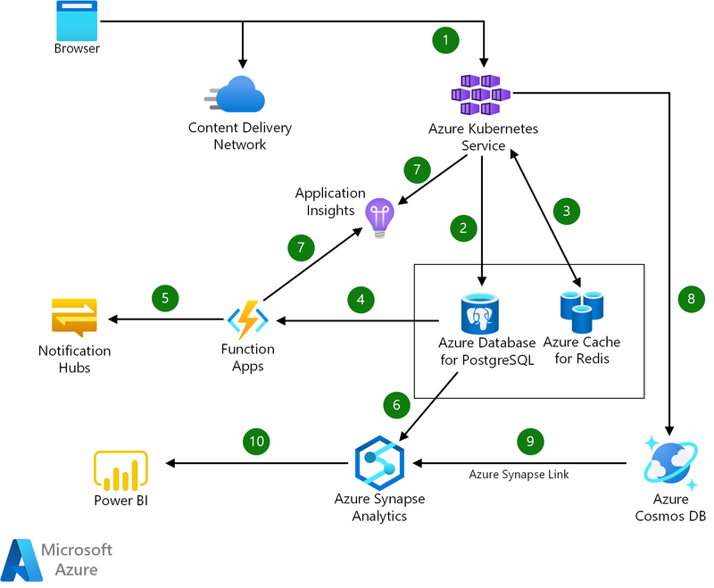

# Get started with Microsoft Cloud-Native

Some relevant resources to get started with Microsoft Cloud-Native technologies.

 - [Azure Container Apps and DAPR](./aca-dapr.md)
 - [Azure Kubernetes Services - AKS](./aks.md)
 - [Azure API Management - APIM](./apim.md)
 - [Azure Serverless](./serverless.md)
 - [Azure DevOps and Github](./devops.md)
 

## Cloud Native Overview

>Cloud-native technologies empower organizations to build and run scalable applications in modern, dynamic environments such as public, private, and hybrid clouds. Containers, service meshes, microservices, immutable infrastructure, and declarative APIs exemplify this approach.
>
>These techniques enable loosely coupled systems that are resilient, manageable, and observable. Combined with robust automation, they allow engineers to >make high-impact changes frequently and predictably with minimal toil.

## Architecture Sample

[Refence-architecture](https://learn.microsoft.com/en-us/azure/architecture/solution-ideas/articles/cloud-native-apps)

