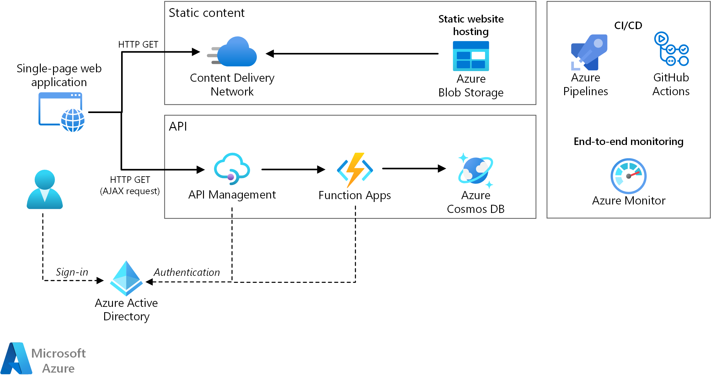

# Azure Serverless Resources

Serverless architecture evolves cloud platforms toward pure cloud-native code by abstracting code from the infrastructure that it needs to run. Azure Functions is a serverless compute option that supports functions, small pieces of code that do single things.

This page gathers a lot of resources to start with **Azure Serverless**

# Overview

 - Azure Functions
 - Azure LogicApps
 - Azure App Services
 - Azure Managed Datastore (SQL, NoSQL)
 - Azure Messaging Services (Service Bus, Event Hub...)

## Architecture

 - [Serverless Functions reference architectures](https://learn.microsoft.com/en-us/azure/architecture/serverless-quest/reference-architectures)

## Links

This section lists a lot of resources to start with **Azure Serverless**

## Tutorial / Workshop

 - [Choose the best Azure serverless technology for your business scenario (AZ-900) - 20m](https://learn.microsoft.com/en-us/training/modules/serverless-fundamentals/)
 - [AZ-204: Implement Azure Functions - 1h30](https://learn.microsoft.com/en-us/training/paths/implement-azure-functions/)
 - [Build serverless, full stack applications in Azure - 3h](https://learn.microsoft.com/en-us/training/paths/build-serverless-full-stack-apps-azure/)
 - [Architect message brokering and serverless applications in Azure learning path - 6h](https://learn.microsoft.com/en-us/training/paths/architect-messaging-serverless/)
 - [Create serverless applications learning path - 8h](https://learn.microsoft.com/en-us/training/paths/create-serverless-applications/)
 

## Blogs

 - [Serverless Zero-to-Hero](https://azure.github.io/Cloud-Native/serverless-september/ZeroToHero/)

## eBook

 - [Azure Serverless Computing Cookbook, Third Edition](https://azure.microsoft.com/en-us/resources/azure-serverless-computing-cookbook/)

## Utilities and 3rd Party 

 - [Service Bus Explorer](https://github.com/paolosalvatori/ServiceBusExplorer)

